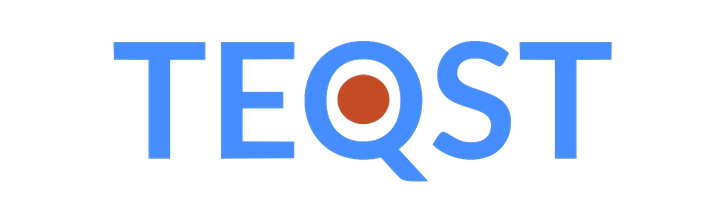
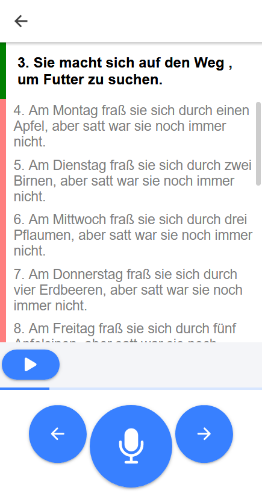
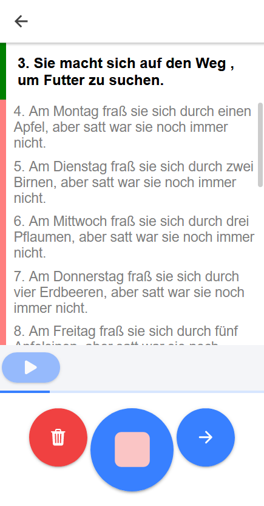

# What is TEQST?

TEQST (Tool to easily quench speechdata thirst) lets you create your own speechdata easily and intuitively. Upload a text, have others record it and download the data.

<!-- TODO more description -->

 &emsp;&emsp;&emsp; 

## The Source Code

We keep our source code in two seperate repositories:

* Frontend: 
* Backend: 
