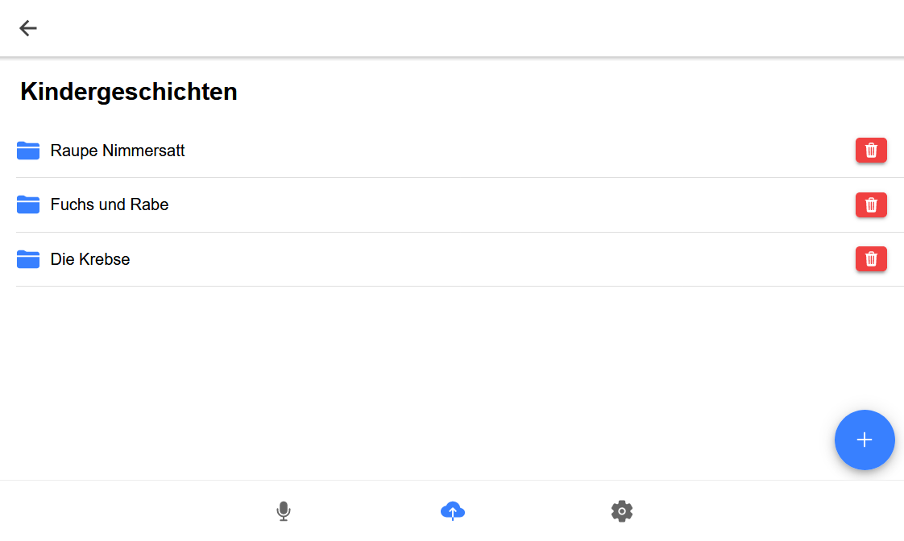

## The Source Code

We keep our source code in two seperate repositories. They are licensed under the GNU GPLv3 License:

* Frontend: https://github.com/sugeedarou/TEQST_Frontend
* Backend: https://github.com/YAWNICK/TEQST_Backend

## What is TEQST?

TEQST (Tool to easily quench speechdata thirst) is a WebApp that lets you create your own speechdata easily and intuitively.

TEQST was created within a practical software engineering course (PSE) at the Institute for Anthropomatics and Robotics (IAR) of the Karlsruhe Institute of Technology (KIT) by Luca Hüttner, Nicolas Scherzinger, Linus Schilpp, Dominik Höfer and Jannik Weiß under supervision of Juan Hussain and Prof. Dr. A. Waibel.

## Documentation

The Frontend - once run - includes an English documentation on how to use TEQST

### Contact

teqst.team@protonmail.com

### Example screenshots

 &emsp;&emsp; 

